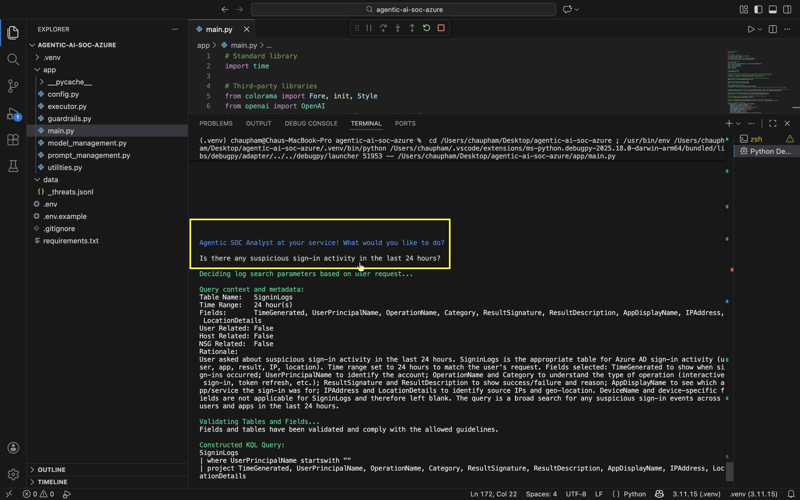
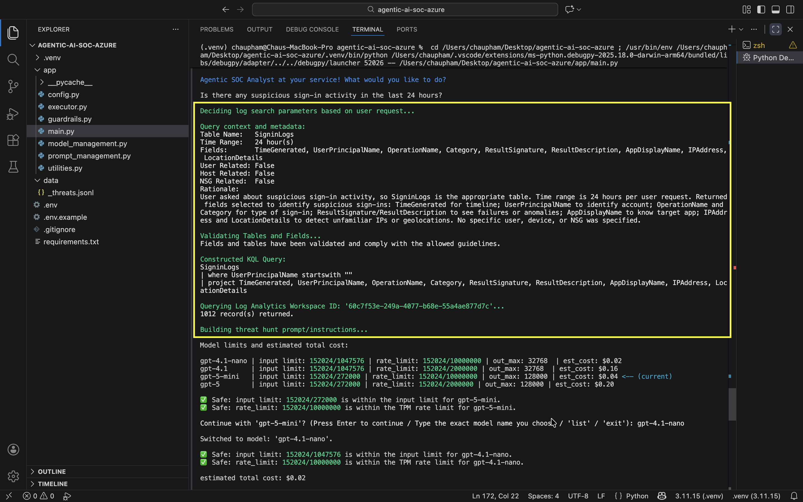
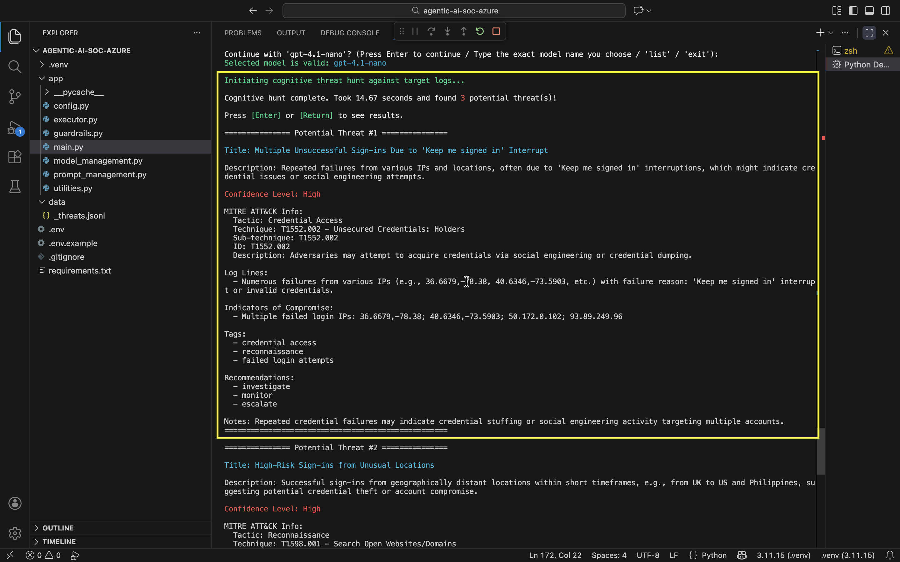
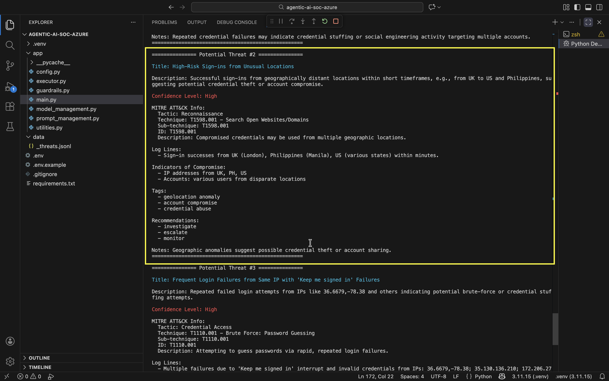
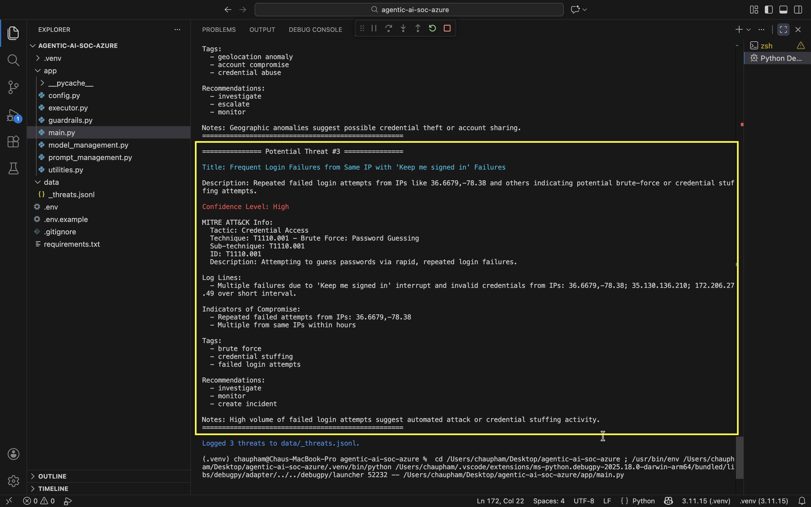

# Agentic AI SOC Analyst for Azure

An AI-assisted SOC workflow built in Python to help analysts investigate suspicious activity in Azure environments using Azure Log Analytics, Microsoft Defender, and OpenAI.

This project demonstrates how a security analyst can use natural language to initiate an investigation, retrieve relevant Azure telemetry, analyze results with an LLM, map findings to MITRE ATT&CK, and produce structured threat findings for analyst review. For high-confidence host-based threats, the workflow can also prompt the analyst to isolate the affected endpoint through Microsoft Defender.

---

## Project Overview

Security analysts often lose time switching between tools, writing one-off queries, filtering noisy logs, and manually summarizing findings.

This project simulates how an AI-assisted SOC analyst could:

- take an investigation question in plain English
- determine the most relevant telemetry source
- collect logs from Azure Log Analytics
- analyze findings with an LLM
- map results to MITRE ATT&CK
- return structured threat findings
- optionally support analyst-approved response actions

The goal is not to replace analysts. The goal is to reduce manual triage time, improve consistency, and support faster threat investigation.

---

## Key Features

- Natural language security investigation workflow
- Table and field guardrails to prevent unsafe queries
- Token-aware model selection
- Cost and input-limit awareness before sending logs to the model
- MITRE ATT&CK mapping in returned findings
- Structured threat output in JSONL format
- Optional analyst-approved host isolation through Microsoft Defender
- Modular Python codebase for easier expansion

---

## Example Use Cases

This project is designed for scenarios such as:

- suspicious Azure sign-in activity
- impossible travel detection
- brute-force or password spraying indicators
- suspicious process creation activity
- malicious network flow review
- host-based threat triage for a specific VM

---

## Architecture Summary

The workflow is organized into modular components:

- **main.py**  
  Runs the full workflow from analyst prompt to final findings

- **prompt_management.py**  
  Builds prompts and handles user input

- **model_management.py**  
  Counts tokens, compares models, estimates cost, and lets the user select a model

- **executor.py**  
  Queries Azure Log Analytics, runs the investigation flow, and handles response actions

- **guardrails.py**  
  Restricts allowed models, tables, and fields

- **utilities.py**  
  Sanitizes context, formats output, and writes findings to JSONL

- **config.py**  
  Loads environment variables

---

## Tech Stack

- Python
- Azure Log Analytics
- Microsoft Defender for Endpoint
- OpenAI API
- JSONL for structured threat logging
- MITRE ATT&CK for threat mapping

---

## Current Project Structure

```text
AGENTIC-AI-SOC-AZURE/
├── app/
│   ├── config.py
│   ├── executor.py
│   ├── guardrails.py
│   ├── main.py
│   ├── model_management.py
│   ├── prompt_management.py
│   └── utilities.py
├── data/
│   └── _threats.jsonl
├── .env.example
├── .gitignore
├── README.md
└── requirements.txt


## Sample Investigation Flow

### 1. Analyst investigation prompt
Shows the workflow accepting a natural language security investigation question and determining the relevant Azure log source, fields, and time range.



### 2. Log search parameter selection
The workflow interprets the investigation request and determines:
- which telemetry table to search
- what fields to retrieve
- what time range to apply
- whether the investigation is **user-focused**, **host-focused**, or **network-focused**



### 3. Azure Log Analytics query execution
The system searches the relevant telemetry based on the investigation scope.

### 4. Model selection and token validation
Demonstrates token-aware model selection, estimated cost review, and validation against model input and rate limits before sending telemetry to the LLM.


### 5. Structured threat findings
Displays the final investigation results, including threat title, description, confidence level, MITRE ATT&CK mapping, indicators of compromise, and recommended analyst actions.

Results are:
- shown to the analyst
- written to `data/_threats.jsonl`






